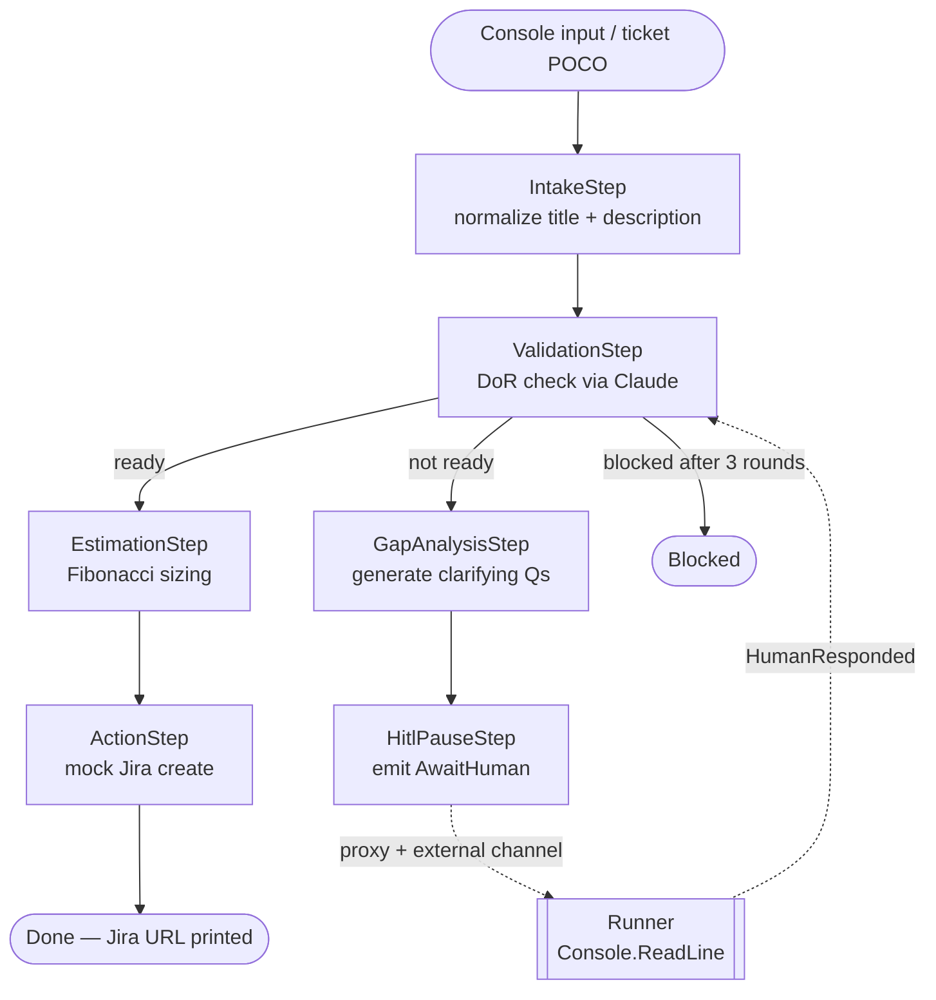

# DBAIAzure — Ticket Intake Pipeline

A standalone .NET 8 demo of Semantic Kernel Process Framework with Anthropic Claude,
built as interview prep for Azure AI engineering roles.

## What this demonstrates

| Concept | Implementation |
|---------|---------------|
| SK Process Framework | `IntakePipelineBuilder` wires 6 steps with typed events — analogous to LangGraph `StateGraph` |
| HITL suspend/resume | `HitlPauseStep` → proxy step → `HitlExternalChannel`; runner re-injects `HumanResponded` |
| Structured LLM output | `ValidationStep` and `EstimationStep` parse typed JSON from Claude responses |
| Fibonacci estimation | `EstimationStep` uses anchor-based reference class forecasting (see below) |
| Azure Monitor tracing | `AddAzureMonitorTraceExporter` auto-instruments every SK call — visible in AI Foundry |
| Provider swap | One-line switch from Anthropic to Azure OpenAI via SK's `IChatCompletionService` |
| Visual Workflow Builder | Drag-and-drop canvas in Blazor Server — design, save, and execute SK pipelines in the browser |

## Architecture



**HITL mechanism:** `HitlPauseStep` emits an `AwaitHuman` event that SK routes through a proxy
step to `HitlExternalChannel` (implements `IExternalKernelProcessMessageChannel`).
`RunToEndAsync` unblocks when the proxy fires; the runner collects console input, increments
`ClarificationRound`, and restarts the process with a `HumanResponded` event pointing directly
at `ValidationStep`. After 3 unsuccessful rounds, `ValidationStep` emits `Blocked` and the
process terminates without escalating further.

This is the .NET equivalent of LangGraph's `interrupt()` / `Command(resume=...)` — but compiled,
typed, and without a Python async context manager.

## Estimation: Fibonacci anchor table

`EstimationStep` uses reference class forecasting — Claude compares the ticket against known
anchor tasks instead of estimating in isolation. The reasoning is returned alongside the number,
making every estimate auditable.

| Points | Anchor |
|--------|--------|
| 1 | Add a null check or log statement |
| 2 | Add a new field to an existing model + migration |
| 3 | Implement a single new REST endpoint with tests |
| 5 | Build a new CRUD feature with validation logic |
| 8 | Build a new integration with an external system |
| 13 | Refactor a core subsystem or migrate a database schema |
| 21 | Architect a new major feature spanning multiple services |

If Claude returns a value outside the Fibonacci sequence, `EstimationStep` clamps it to the
nearest valid value via `ValidPoints.MinBy(p => Math.Abs(p - result.Points))`.

## Getting Started

### 1. Prerequisites

| Requirement | Notes |
|-------------|-------|
| [.NET 8 SDK](https://dotnet.microsoft.com/download/dotnet/8.0) | Version **8.0.422** or later 8.x patch. The repo pins the SDK via `global.json`; run `dotnet --version` to confirm. |
| Anthropic API key | Required for LLM calls. Create one at [console.anthropic.com](https://console.anthropic.com). |
| Git | Any recent version. |
| PowerShell 7+ | For the helper start/stop scripts. Optional — you can use `dotnet run` directly. |
| Azure DevOps PAT | Optional. Only needed if you want work items created in your ADO project. |
| Teams Power Automate URL | Optional. Only needed for human-in-the-loop notifications. |

### 2. Clone and restore

```bash
git clone https://github.com/<your-fork>/AzureWorkflowPOC.git
cd AzureWorkflowPOC
dotnet restore
```

### 3. Configure your development secrets

The web app reads from `appsettings.Development.json`, which is gitignored and never committed.
Create it from the checked-in template:

```bash
cp src/DBAIAzure.Web/appsettings.json src/DBAIAzure.Web/appsettings.Development.json
```

Then open the new file and set your Anthropic credentials. All other sections can stay as
placeholder values — they are configured later through the in-app connector dialog:

```json
{
  "Anthropic": {
    "ApiKey": "sk-ant-...",
    "Model": "claude-sonnet-4-6"
  }
}
```

`AzureMonitor.ConnectionString` is optional — the app skips tracing gracefully if it is blank.

### 4. Build the solution

```bash
dotnet build
```

A clean build with zero errors and zero warnings is the baseline. The test suite also builds
here; if compilation fails, `dotnet test` will not run.

### 5. Start the web app

**Option A — PowerShell helper (recommended)**

```powershell
.\scripts\start-web.ps1
```

The script builds, launches `DBAIAzure.Web` on `http://localhost:5000`, polls until the port
is ready, and opens your browser automatically. Logs are written to `%TEMP%\DBAIAzure.Web.log`.

**Option B — dotnet run**

```bash
dotnet run --project src/DBAIAzure.Web
```

The SQLite database (`pipeline.db`) is created automatically on first startup via idempotent
`CREATE TABLE IF NOT EXISTS` statements — no migration commands are needed.

### 6. Configure connectors (first-time only)

Click the **⚙ gear icon** in the top-right of the **Threads** page (the home page at `/`).
The connector dialog lists every integration. For each connector you want active:

1. Click the connector card to open its configuration panel.
2. Enter credentials (API keys and secrets are encrypted at rest — they never appear in logs or
   the database in plaintext).
3. Click **Test** to run a live functional check against the real endpoint.
4. Click **Save** when the test passes.

For the default pipeline demo you only need the **LLM (Anthropic)** connector. Azure DevOps,
Teams, and ServiceNow connectors are optional and extend the pipeline with work item creation,
HITL notifications, and real ticket reads respectively.

> **Hot-reload note:** LLM credentials are resolved from the database at the start of each
> pipeline run, not at server startup. You can reconfigure a connector and the next run picks
> up the new values immediately — no restart required.

### 7. Run the default intake pipeline

Navigate to **Threads** (the home page at `/`) and submit a ticket via **+ New Thread**. The
two built-in demo tickets are:

| Ticket | Description | Expected path |
|--------|-------------|---------------|
| INC0001001 | Well-formed ticket with clear scope | Happy path → DoR check → Fibonacci estimate → mock Jira URL |
| INC0001002 | Vague: "Fix the thing with login" | Gap analysis → HITL pause → web input → re-validation |

**From the console runner (no browser required)**

```bash
dotnet run --project src/DBAIAzure.Runner
```

Both demo tickets run in sequence. INC0001002 pauses at the HITL step and prompts you to
type clarifying information in the terminal before continuing.

### 8. Explore the Visual Workflow Builder

Navigate to **Workflow Builder** (`/workflow-builder`) to design and execute custom pipelines
using the drag-and-drop canvas. Node types include `AgenticReason`, `HumanApproval`,
`FunctionRoute`, `FunctionTransform`, `FunctionNotify`, and `FunctionData`. Use the chat
sidebar to describe a workflow in natural language and generate Semantic Kernel code
automatically.

Saved workflows appear in the **Gallery** (`/workflow-gallery`) with auto-generated thumbnails.

### 9. Run the test suite

```bash
dotnet test
```

The test suite covers DoR JSON parsing, Fibonacci clamping, record immutability,
`HitlExternalChannel` event routing, Visual Workflow Builder node operations, and the
Workflow UX (diff view, unsaved-changes modal, gallery search). All tests pass without
hitting a live LLM — no API key is required to run them.

## Swapping to Azure OpenAI

The custom `AnthropicChatCompletionService` implements SK's `IChatCompletionService`.
To swap to Azure OpenAI, replace these lines in `Program.cs`:

```csharp
// Current — custom Anthropic service
kernelBuilder.Services.AddSingleton<IChatCompletionService>(
    new AnthropicChatCompletionService(anthropicKey, anthropicModel));
```

```csharp
// Azure OpenAI drop-in
kernelBuilder.AddAzureOpenAIChatCompletion(deployment, endpoint, apiKey);
```

No other changes required. The process steps, event routing, HITL logic, and observability
pipeline are completely unchanged — that is the SK abstraction working correctly.

## Solution structure

```
src/
  DBAIAzure.Core/        # Domain models and interfaces — no Azure deps, no I/O
  DBAIAzure.Processes/   # SK Process steps, pipeline builders, HITL external channel
  DBAIAzure.Connectors/  # FakeTicketConnector (simulates ServiceNow ticket read)
  DBAIAzure.Storage/     # SQLite persistence via EF Core — runs, phase runs, connector configs, workflows
  DBAIAzure.Web/         # ASP.NET Core 8 Blazor Server — main UI, DI wiring, webhook endpoints
  DBAIAzure.Runner/      # Console demo entry point — two demo tickets, no browser required
tests/
  DBAIAzure.Tests/       # xUnit — pure-logic unit tests, no LLM required
```

## Interview talking points

| Concept | What to say |
|---------|-------------|
| SK PF vs LangGraph | "SK PF is .NET-native, event-driven, and production-grade. Steps communicate via strongly-typed events rather than a shared state dictionary." |
| HITL | "External events let the process suspend and resume across async boundaries via `IExternalKernelProcessMessageChannel` — same semantic as LangGraph `interrupt()` but compiled and typed." |
| Structured output | "`InvokePromptAsync` with a JSON schema instruction — same as LangChain's `with_structured_output`, but with C# records instead of Pydantic models." |
| Foundry tracing | "`AddAzureMonitorTraceExporter` auto-instruments every SK call — token counts, latency, and prompt/completion text visible in Foundry without a single manual span." |
| Provider swap | "Built against Anthropic for speed; swapping to Azure OpenAI is one line. That proves the SK abstraction is working correctly." |
| Fibonacci estimation | "Anchor-based reference class forecasting — Claude compares against known tasks instead of guessing in isolation. Every estimate comes with auditable reasoning, not just a number." |
| Visual Workflow Builder | "Drag-and-drop canvas that generates Semantic Kernel Process code from a natural-language description — demonstrates how SK's typed event model can be surfaced to non-developers." |
