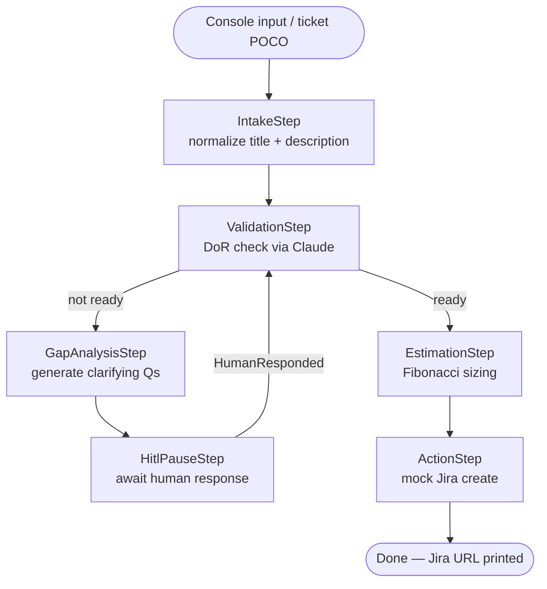

# DBAIAzure — Ticket Intake Pipeline

A standalone .NET 8 demo of Semantic Kernel Process Framework with Anthropic Claude,
built as interview prep for Azure AI engineering roles.

## What this demonstrates

| Concept | Implementation |
|---------|---------------|
| SK Process Framework | `IntakePipelineBuilder` wires steps with typed events — analogous to LangGraph `StateGraph` |
| HITL suspend/resume | `HitlPauseStep` emits a public external event; runner re-injects `HumanResponded` |
| Structured LLM output | `ValidationStep` and `EstimationStep` parse typed JSON from Claude |
| Fibonacci estimation | `EstimationStep` uses anchor-based reference class forecasting (see below) |
| Azure Monitor tracing | `AddAzureMonitorTraceExporter` auto-instruments every SK call — visible in Foundry |
| Provider swap | One-line switch from Anthropic to Azure OpenAI via SK's `IChatCompletionService` |

## Architecture



## Estimation: Fibonacci anchor table

The `EstimationStep` uses reference class forecasting — the LLM compares the ticket
against known anchor tasks instead of estimating in isolation. This produces auditable
reasoning, not just a number.

| Points | Anchor |
|--------|--------|
| 1 | Add a null check or log statement |
| 2 | Add a new field to an existing model + migration |
| 3 | Implement a single new REST endpoint with tests |
| 5 | Build a new CRUD feature with validation logic |
| 8 | Build a new integration with an external system |
| 13 | Refactor a core subsystem or migrate a database schema |
| 21 | Architect a new major feature spanning multiple services |

## Setup

### 1. Prerequisites

- .NET 8 SDK
- Anthropic API key (or Azure OpenAI credentials)
- Optional: Azure Application Insights connection string for distributed tracing

### 2. Configure secrets

Copy the template and fill in your keys:

```bash
# The Development file is gitignored — never commit it
cp src/DBAIAzure.Runner/appsettings.json src/DBAIAzure.Runner/appsettings.Development.json
```

Edit `appsettings.Development.json`:

```json
{
  "Anthropic": {
    "ApiKey": "sk-ant-...",
    "Model": "claude-3-5-sonnet-20241022"
  },
  "AzureMonitor": {
    "ConnectionString": "InstrumentationKey=...;IngestionEndpoint=..."
  }
}
```

### 3. Run

```bash
dotnet run --project src/DBAIAzure.Runner
```

### 4. Test

```bash
dotnet test
```

## Swapping to Azure OpenAI

In `Program.cs`, replace:
```csharp
.AddAnthropicChatCompletion(anthropicModel, anthropicKey)
```
with:
```csharp
.AddAzureOpenAIChatCompletion(deployment, endpoint, apiKey)
```

That is the only change. The SK abstraction handles the rest — same process steps, same
structured output parsing, same Foundry tracing.

## Solution structure

```
src/
  DBAIAzure.Core/        # Domain models + interfaces (no Azure deps)
  DBAIAzure.Processes/   # SK Process steps + IntakePipelineBuilder
  DBAIAzure.Connectors/  # FakeTicketConnector (simulates ServiceNow)
  DBAIAzure.Runner/      # Console entry point + config
tests/
  DBAIAzure.Tests/       # xUnit — pure-logic unit tests (no LLM required)
```
