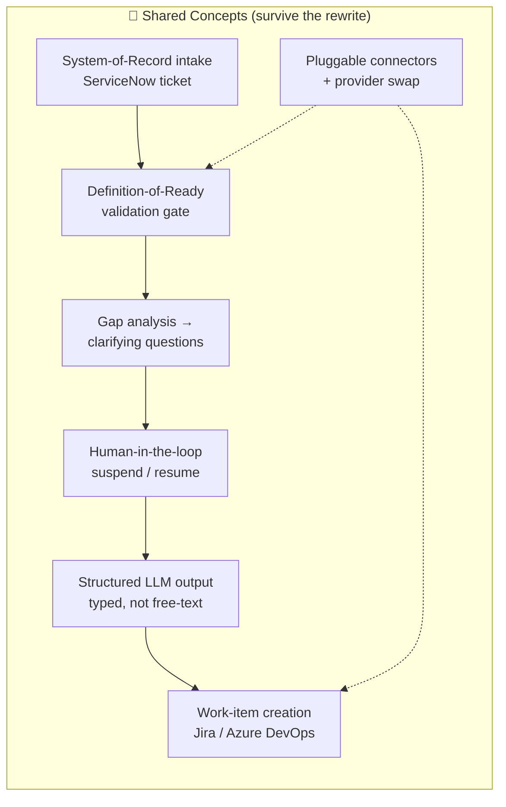
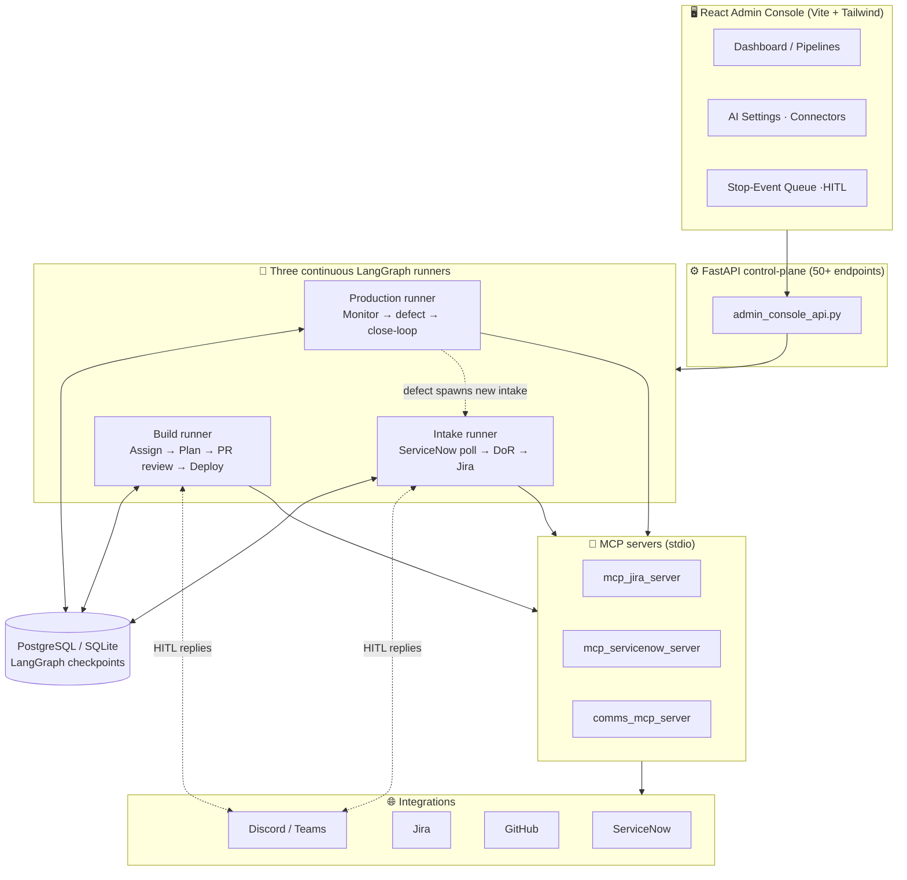
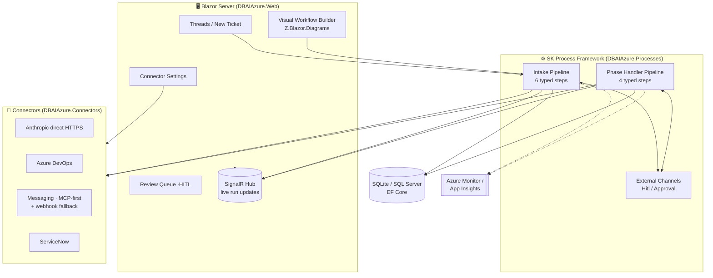
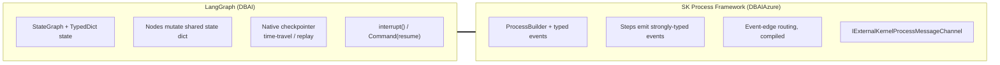
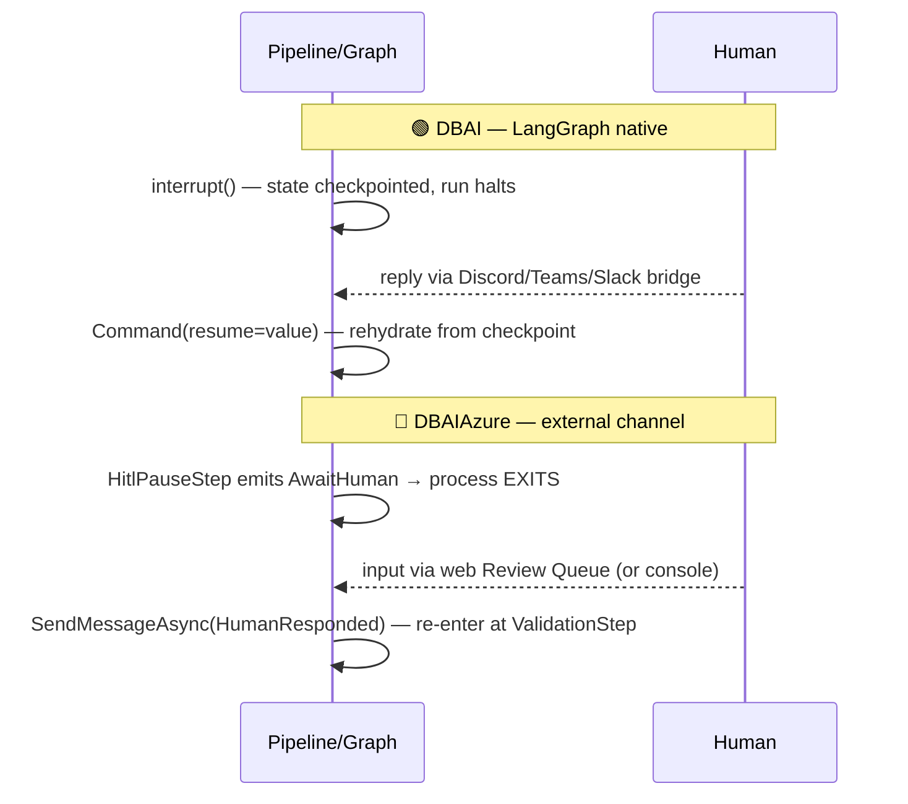
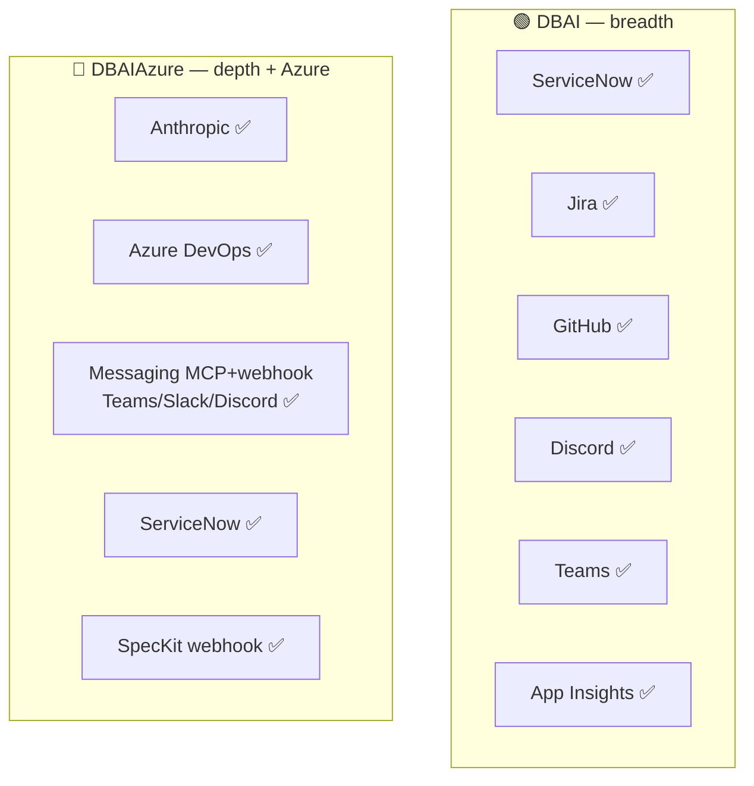
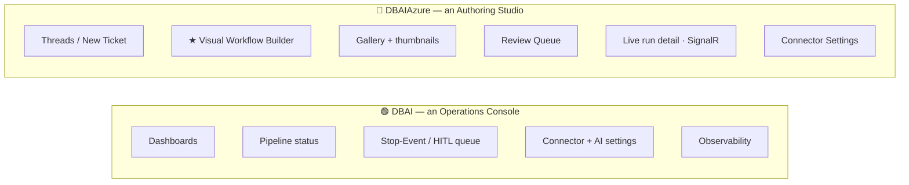
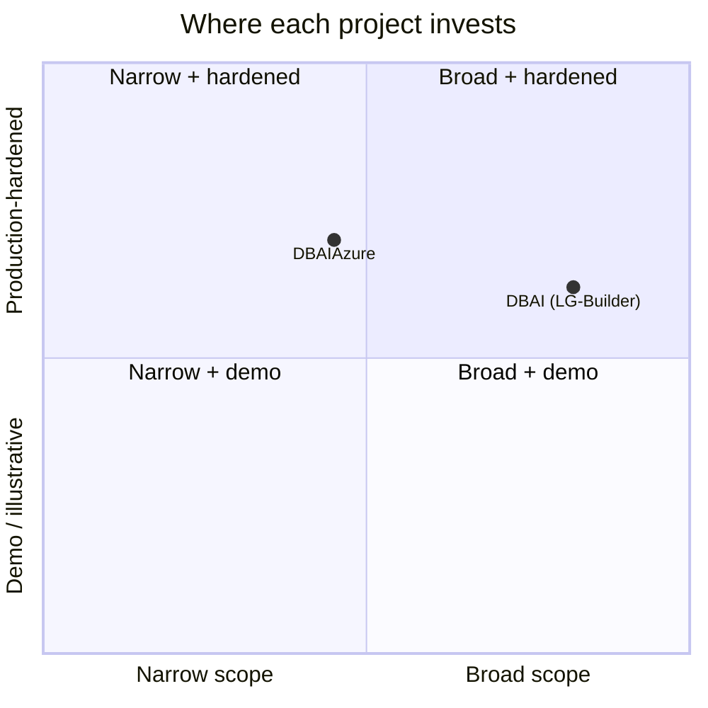
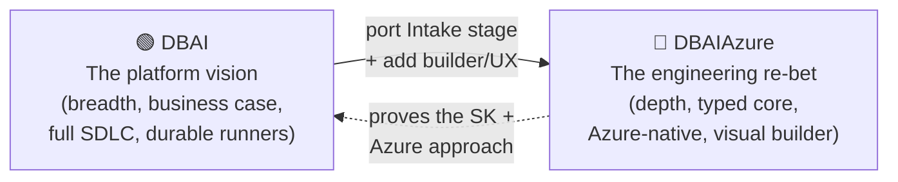

# LG‑Builder (DBAI) ↔ DBAIAzure — Architecture Comparison

> A high‑to‑mid level comparison of the **original Python/LangGraph proof‑of‑concept**
> (`C:\ProjectsWin\DBAI`, internally *LG‑Builder*) and its **.NET 8 / Semantic Kernel
> re‑implementation** (`C:\ProjectsWin\AzureWorkflowPOC`, internally *DBAIAzure*).
>
> The two projects share a thesis — *an AI‑augmented software delivery pipeline with
> human‑in‑the‑loop gates* — but make almost opposite engineering bets: **Python vs .NET**,
> **LangGraph vs Semantic Kernel Process Framework**, **breadth of a full 3‑stage SDLC vs depth
> of one stage plus a visual builder**.

---

## 1. TL;DR — the one‑paragraph version

| | 🟢 **DBAI / LG‑Builder** (original POC) | 🔵 **DBAIAzure** (re‑implementation) |
|---|---|---|
| **Essence** | A broad, business‑framed **platform vision**: watch a System‑of‑Record, gate work through HITL, hand it to AI build agents, observe production, and *close the loop*. | A focused, **engineering‑grade demo**: the Intake stage re‑built on a typed, compiled stack, plus a drag‑and‑drop **Visual Workflow Builder** that generates pipeline code. |
| **Runtime** | Python 3.13 · LangGraph · FastAPI · React | .NET 8 · Semantic Kernel Process Framework · Blazor Server |
| **Scope** | 3 stages: **Intake → Build → Production** (close‑the‑loop) | 2 pipelines: **Intake** + **Phase Handler**; broad **builder/UX** surface |
| **Maturity story** | Heavy **strategy/governance/ROI** docs; multi‑connector breadth | Heavy **typed code + tests**; production‑parity & observability depth |
| **Headline feature** | Continuous runners + multi‑channel HITL across the whole SDLC | Visual builder + LLM “node realization” + MCP‑first messaging |

---

## 2. Shared lineage — what carried across the rewrite

Both systems are the *same idea* expressed in two ecosystems. The conceptual DNA is identical:

| Shared concept | DBAI (Python) | DBAIAzure (.NET) |
|---|---|---|
| Intake normalization | `intake_logic.py` · `TicketContentNormalizer` | `IntakeStep` |
| DoR validation | `validator_logic.py` + `llm_validation_client.py` | `ValidationStep` |
| Gap analysis | `gap_logic.py` · `RequirementsGapQuestionGenerator` | `GapAnalysisStep` |
| HITL pause/resume | LangGraph `interrupt()` / `Command(resume=…)` | `HitlPauseStep` + `IExternalKernelProcessMessageChannel` |
| Structured output | LangChain `.with_structured_output(Pydantic)` | Claude forced tool‑use → C# `record` |
| Work‑item write | `jira_logic.py` / `mcp_jira_server.py` | `ActionStep` / `AzureDevOpsConnectorAdapter` |
| Provider swap | `chat_model_factory.py` (Anthropic/OpenAI/Google) | `IChatCompletionService` (Anthropic ↔ Azure OpenAI) |

> **The rewrite is a *port of the Intake stage* plus net‑new builder/UX surface — not a
> 1:1 reproduction of the whole platform.** Build & Production stages remain DBAI‑only.

---

## 3. Side‑by‑side architecture

### 3a. DBAI / LG‑Builder — three continuous runners over a shared checkpoint store

### 3b. DBAIAzure — two SK pipelines behind a Blazor app

---

## 4. The decision that defines everything — orchestration engine

| Dimension | 🟢 LangGraph | 🔵 SK Process Framework |
|---|---|---|
| **Paradigm** | Shared‑state graph (state dict mutated by nodes) | Event‑driven steps (strongly‑typed event edges) |
| **Typing** | Python + Pydantic (runtime validation) | C# records (compile‑time guarantees) |
| **State model** | One `TypedDict` per graph, threaded through nodes | Per‑step inputs/outputs via emitted events |
| **Persistence** | **Native checkpointer** — durable, replay, time‑travel | App‑level EF Core records (no built‑in time‑travel) |
| **Maturity** | GA (`langgraph >=1.2`) | **Process module is `-alpha`** (`1.77.0‑alpha`) |
| **HITL primitive** | First‑class `interrupt()` / `Command(resume=…)` | Proxy step → external channel → re‑inject event |
| **Routing** | Conditional edges + `Command(goto=…)` | Named event → step edges declared in builder |
| **Strength** | Durable execution, pause survives restart by design | Type safety, native .NET DI, auditable compiled flow |

> **Trade‑off in one line:** LangGraph buys you *durable, replayable execution for free*;
> SK buys you *compile‑time type safety and first‑class .NET tooling* — at the cost of a
> still‑**alpha** process module and app‑managed persistence.

---

## 5. Human‑in‑the‑loop — same intent, different mechanics

| | 🟢 DBAI | 🔵 DBAIAzure |
|---|---|---|
| **Pause** | `interrupt()` halts mid‑graph, state persisted | Step emits external event; **whole process exits** |
| **Where the human answers** | Discord / Teams / Slack (multi‑channel bridges) | Web **Review Queue** UI (+ console in Runner) |
| **Resume** | `Command(resume=…)` from checkpoint | Re‑inject event; routes straight to next step |
| **Survives restart?** | ✅ Yes — checkpoint is durable | ⚠️ Bounded by app‑level run records |
| **Escalation/SLA** | `sla_enforcement.py` — tracking + escalation | Not a first‑class concern (demo‑scoped) |
| **Coordination** | `hitl_coordinator.py` multi‑channel policy | `MessagingHitlNotifier` (non‑blocking notify) |

---

## 6. Connectors & integrations

| Integration | DBAI | DBAIAzure | Notes |
|---|:--:|:--:|---|
| ServiceNow | ✅ | ✅ | DBAI: poll + writeback + webhook; Azure: client + mapper |
| Jira | ✅ | ⚪ | Azure uses **Azure DevOps Boards** instead of Jira |
| Azure DevOps | ⚪ | ✅ | Azure‑native work‑item creation + telemetry preflight |
| GitHub | ✅ | ⚪ | DBAI Build stage polls PRs by Jira‑id branch |
| Messaging (Teams) | ✅ | ✅ | DBAI: Graph polling; Azure: **MCP‑first + webhook** |
| Messaging (Slack/Discord) | ✅ (Discord) | ✅ | Azure spec 010 adds Slack + Discord profiles |
| MCP transport | stdio (local subprocess) | **HTTP/SSE (remote)** | Key architectural difference ↓ |
| Observability sink | Langfuse + OTEL | Azure Monitor / App Insights | Each native to its cloud story |
| SpecKit / Forge | — | ✅ | Azure‑only phase‑approval webhook loop |

> **MCP, two ways.** DBAI spawns **local stdio MCP servers** it *owns* (`mcp_jira_server.py`,
> `comms_mcp_server.py`). DBAIAzure is an **MCP *client*** that calls a **remote** server over
> HTTP/SSE (`ModelContextProtocol.Client`), with a per‑platform **webhook fallback** if MCP is
> unavailable.

---

## 7. Tech stack at a glance

| Layer | 🟢 DBAI / LG‑Builder | 🔵 DBAIAzure |
|---|---|---|
| **Language** | Python 3.13 | C# / .NET 8 (SDK pinned `8.0.422`) |
| **Orchestration** | LangGraph `>=1.2` | Semantic Kernel `1.77.0` + Process `‑alpha` |
| **LLM access** | LangChain (`anthropic`/`openai`/`google‑genai`) | Direct HTTPS `AnthropicChatCompletionService` |
| **Provider swap** | `chat_model_factory` (3 providers) | `IChatCompletionService` (Anthropic ↔ Azure OpenAI) |
| **API / backend** | FastAPI + Uvicorn | ASP.NET Core 8 |
| **Frontend** | React 18 + Vite + TS + Tailwind + `@xyflow/react` | Blazor Server + `Z.Blazor.Diagrams` |
| **Persistence** | LangGraph checkpoints (SQLite→Postgres) + admin SQLite | EF Core (SQLite→SQL Server) |
| **Messaging libs** | `discord.py`, MS Graph, `mcp` | `ModelContextProtocol.Core`, webhook profiles |
| **Observability** | Langfuse + OpenTelemetry (OTLP) | App Insights + Azure Monitor OTel exporter |
| **Tests** | `pytest` (~140 test modules) | `xUnit` (~60 unit) + `bunit` + **Playwright** E2E (~13) |
| **Deploy** | Docker Compose (7 services) + Railway | `dotnet publish`; PowerShell run scripts; Key Vault |
| **Secrets** | Per‑user keys in UI; non‑root containers | EF Core + **DataProtection** encryption at rest |

---

## 8. UI philosophy — operate vs. author

| Aspect | 🟢 DBAI | 🔵 DBAIAzure |
|---|---|---|
| **Primary intent** | **Operate** a running pipeline (monitor, approve) | **Author** pipelines visually + run them |
| **Canvas** | `@xyflow/react` (view/config) | `Z.Blazor.Diagrams` drag‑and‑drop builder |
| **Killer feature** | Continuous multi‑stage runner dashboards | **LLM “node realization”** — describe in NL → SK code |
| **Live updates** | Poll / status push | **SignalR** push to `RunDetail` |
| **Node types** | Catalog of step types (`workflow_step_catalog.py`) | Agentic / Approval / Route / Transform / Notify / Data |

---

## 9. Scope & scale — breadth vs. depth

| Metric | 🟢 DBAI | 🔵 DBAIAzure |
|---|---|---|
| Core source modules | ~104 Python files (workflow‑poc) | 6 projects, ~97 C# files in core/processes/connectors |
| SDLC stages implemented | **3** (Intake, Build, Production) | **1.5** (Intake + Phase Handler) |
| Continuous runners | 3 (always‑on poll loops) | 0 (event/UI‑triggered runs) |
| Pipeline steps | ~15 catalog step types | 17 step classes across 2 pipelines |
| Agents | 5 (Intake/Validator/Gap/Jira/Configurator) | Step‑based (no separate agent registry) |
| MCP servers | 3 (own, stdio) | MCP **client** (remote) + webhook fallback |
| Integrations | 6 | 5 (Azure‑leaning) |
| Strategy/business docs | **Extensive** (ROI, Governance, Vision, pitch) | README + per‑feature specs (10 features) |
| Feature specs | 3 in `/specs` + 5 plans | **10** numbered specs (Spec Kit pipeline) |
| Test modules | ~140 (`pytest`) | ~73 (`xUnit` + `bunit` + Playwright) |

---

## 10. Business framing — the biggest non‑code difference

DBAI ships a **business case**; DBAIAzure ships **engineering evidence**.

| DBAI strategic asset | What it contains |
|---|---|
| `ROI.md` | **$597K** projected Year‑1 net benefit · **3.2×** risk‑adjusted ROI · 45‑dev model |
| `GOVERNANCE.md` | AI Steering Committee · acceptable‑use · risk tiers · human‑gate policy |
| `IMPLEMENTATION.md` | 4‑phase rollout: Pilot → Expanded → Full → Optimization (12 mo) |
| `AI-WORKFLOW.md` | Framework bake‑off: CrewAI vs LangChain vs LlamaIndex vs AutoGen → LangGraph |
| `PO-UAT-*` / `VALIDATION-ROADMAP.md` | “Tests pass ≠ done” — PO‑driven E2E acceptance |
| `pitch/` · `command-cards/` · `plans/` | Exec pitch + next‑gen *Supervisor/Flowbot* architecture vision |

DBAIAzure’s framing is narrower and explicit in its own README: **“built as interview prep for
Azure AI engineering roles.”** Its artifacts are *per‑feature Spec Kit folders* (spec → plan →
tasks → contracts) and a test suite — proof‑of‑craft rather than proof‑of‑business‑value.

---

## 11. Strengths & trade‑offs

| | 🟢 DBAI / LG‑Builder | 🔵 DBAIAzure |
|---|---|---|
| **Strengths** | Full‑lifecycle vision · durable LangGraph checkpoints · multi‑channel HITL + SLA · rich business/governance case · broad connectors | Compile‑time type safety · Azure‑native observability/secrets · **visual builder + LLM code‑gen** · disciplined Spec‑Kit + Playwright tests · clean provider swap |
| **Trade‑offs** | Python runtime weak‑typing · larger surface to keep coherent · ops‑console UX over authoring | **Alpha** process module · only Intake stage ported · no continuous runners · app‑managed (not native) durability |
| **Best when…** | You want the *whole platform story* and durable long‑running automation | You want a *typed, Azure‑first* core and a way for non‑devs to **design** pipelines |

---

## 12. Feature parity matrix

| Capability | 🟢 DBAI | 🔵 DBAIAzure |
|---|:--:|:--:|
| Intake → DoR → Gap → HITL → estimate → work‑item | ✅ | ✅ |
| Fibonacci / reference‑class estimation | ⚪ | ✅ |
| AI‑Augmented **Build** stage (plan → PR → deploy) | ✅ | ❌ |
| **Production** monitoring + close‑the‑loop | ✅ | ❌ |
| Continuous always‑on runners | ✅ | ❌ |
| Durable native checkpoint / replay | ✅ | ⚪ (app‑level) |
| Visual drag‑and‑drop builder | ⚪ (view) | ✅ |
| LLM node realization (NL → pipeline code) | ❌ | ✅ |
| Phase‑Handler / SpecKit approval loop | ❌ | ✅ |
| Multi‑channel HITL (Discord/Teams/Slack) | ✅ | ✅ |
| MCP integration | ✅ (server, stdio) | ✅ (client, HTTP/SSE) |
| Azure DevOps work items | ⚪ | ✅ |
| Azure Monitor / App Insights | ⚪ (sim) | ✅ |
| Playwright E2E suite | ✅ | ✅ |
| ROI / governance / rollout docs | ✅ | ❌ |

**Legend:** ✅ present · ⚪ partial/different form · ❌ not present

---

## 13. How to read the two together

- **If you want to understand the *what and why*** — the business problem, the lifecycle, the
  ROI and governance — read **DBAI**. It is the originating vision with the widest surface.
- **If you want to understand the *how, done in .NET/Azure*** — typed orchestration, a visual
  authoring studio, Azure‑native observability and secrets — read **DBAIAzure**. It is the
  deeper, narrower, compile‑checked re‑implementation of the pipeline’s heart.

They are best understood as **two takes on one idea**: a Python platform that *describes the whole
journey*, and a .NET demo that *re‑engineers the engine room* with a builder bolted on top.

---

Generated as a documentation artifact comparing `C:\ProjectsWin\DBAI` (LG‑Builder) and
`C:\ProjectsWin\AzureWorkflowPOC` (DBAIAzure). Diagrams use Mermaid; render in any
Mermaid‑aware Markdown viewer (GitHub, VS Code with the Mermaid extension, Obsidian, etc.).
